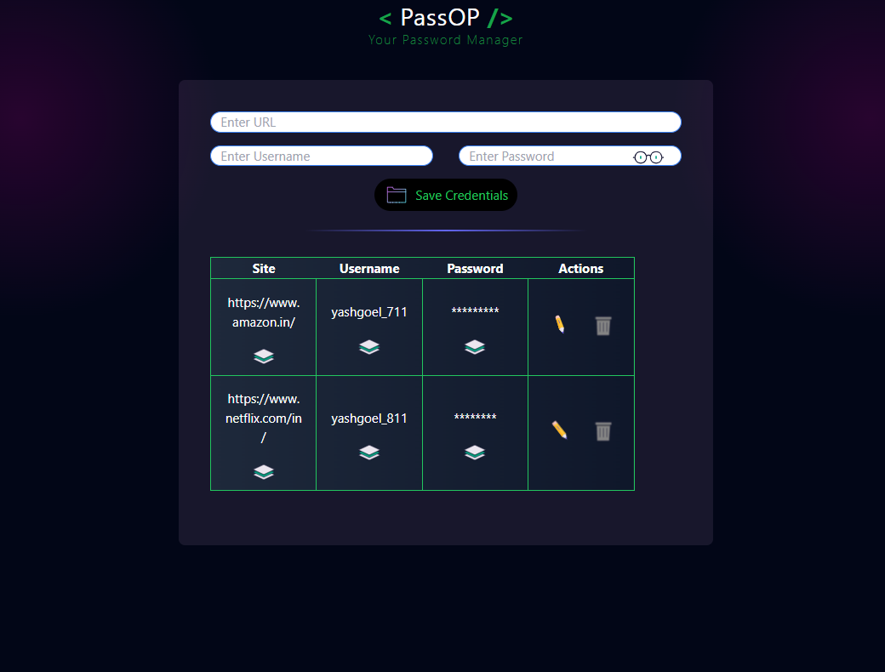

<!-- 
This template provides a minimal setup to get React working in Vite with HMR and some ESLint rules.

Currently, two official plugins are available:

- [@vitejs/plugin-react](https://github.com/vitejs/vite-plugin-react/blob/main/packages/plugin-react/README.md) uses [Babel](https://babeljs.io/) for Fast Refresh
- [@vitejs/plugin-react-swc](https://github.com/vitejs/vite-plugin-react-swc) uses [SWC](https://swc.rs/) for Fast Refresh -->

## Password Manager Using React 
## Mini-Project (by Yash Goel)

This is a Password Manager WebApp built with React . it is a secure and efficient tool that allows users to store, manage, and retrieve their passwords for various accounts. It ensures that users can access their credentials safely without remembering multiple passwords.

## Project Details
> ## Features :
>
>
> 
> 1. Password Storage : Uses Client's Browser Local Storage thus leaves no room for data breaches.
>
> 2. Users can store account credentials, including usernames and passwords.
>
>
>
>
>
>
> 3. Copy to Clipboard : Making easy for user to access stored credentials.
>
> 4. A button to copy passwords securely to the clipboard.
Responsive Design:
>
> 5. Highly Optimized for mobile, tablet, and desktop users.

> ## Technologies Used :
> 1. Frontend: React along with various other React Libraries.
>
> 2. Styling: CSS, Tailwind CSS and Material-UI for a polished UI.
> 3. Interactive : used various MORPH-Triggered Highly Optimized JSON Format Animated Icons for user interactivity.   
> 3. Storage : Client's Local Storage (for preventing DATA-Breaches).
>
> 4. Flash Meassages : For Indicating user the successful registration of credentials.

## UI : 
